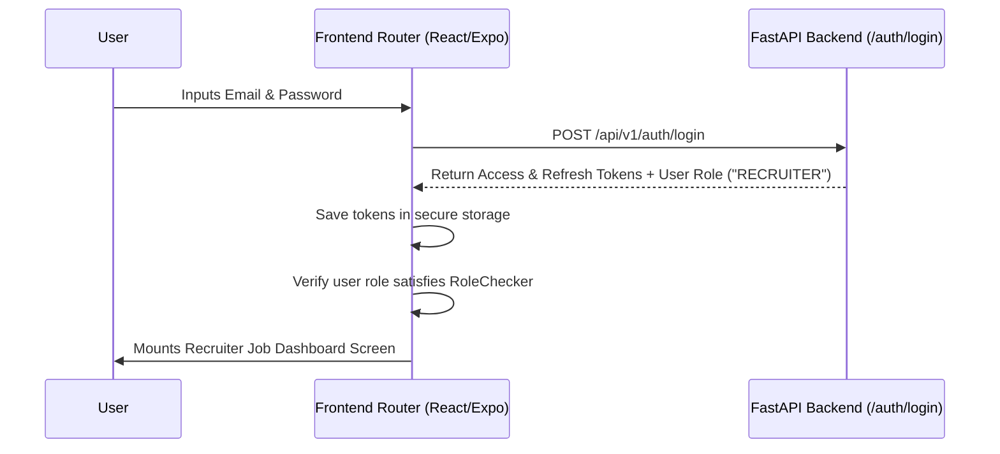
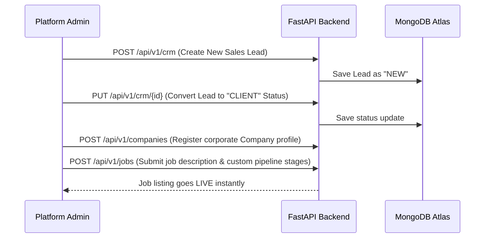
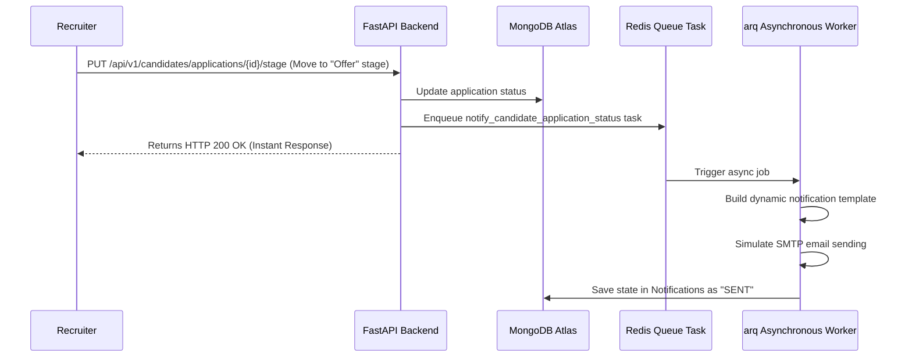

# CoreVita Advisory Private Limited - API Integration & Workflow Guide

This document provides a highly detailed guide of all **FastAPI backend endpoints, request/response models, and full system workflows** built for **CoreVita Advisory Private Limited**. 

It is designed to be shared with **clients** (to showcase backend completion) and **AI frontend builders** (such as v0, Cursor, or ChatGPT) to automatically generate and wire up a stunning frontend user interface.

---

## 1. System-Wide Architectural Overview

The backend is built around a secure **Role-Based Access Control (RBAC)** architecture using JWT authentication. Every API request must include a standard Authorization Header.

### A. Authentication Header
All protected endpoints require the client to send a Bearer Token in the HTTP headers:
```http
Authorization: Bearer <your_jwt_access_token>
```

### B. Standard User Roles
* **`SUPER_ADMIN`**: Full platform authority. Bypasses all validation gates and is allowed to perform any action (including billing, user deletion, configuration updates).
* **`ADMIN`**: Platform coordinator. Manages recruiters, candidates, leads, and CMS content.
* **`RECRUITER`**: Handles job listings, candidates, and moves job applications through stages.
* **`CLIENT`**: Limited access. Allowed to view assigned companies, open jobs, and candidate statuses.

---

## 2. API Endpoint Registry

All routes are prefixed under `/api/v1`.

### Module A: Authentication (`/auth`)

Handles token generations, registration, and refresh routines.

#### 1. Register a User
* **Method**: `POST`
* **Path**: `/api/v1/auth/register`
* **Auth Required**: None (Public)
* **Request Payload (`application/json`)**:
  ```json
  {
    "email": "user@example.com",
    "password": "securepassword123",
    "name": "John Doe",
    "role": "CLIENT"
  }
  ```
* **Response (`201 Created`)**:
  ```json
  {
    "id": "60c72b2f9b1d8b2bad000001",
    "email": "user@example.com",
    "name": "John Doe",
    "role": "CLIENT",
    "is_active": true
  }
  ```

#### 2. User Login
* **Method**: `POST`
* **Path**: `/api/v1/auth/login`
* **Auth Required**: None (Form Login)
* **Request Payload (`application/x-www-form-urlencoded`)**:
  * `username`: user@example.com
  * `password`: securepassword123
* **Response (`200 OK`)**:
  ```json
  {
    "access_token": "eyJhbGciOi...",
    "refresh_token": "eyJhbGciOi...",
    "token_type": "bearer",
    "user": {
      "id": "60c72b2f9b1d8b2bad000001",
      "email": "user@example.com",
      "name": "John Doe",
      "role": "CLIENT"
    }
  }
  ```

#### 3. Token Refresh
* **Method**: `POST`
* **Path**: `/api/v1/auth/refresh`
* **Auth Required**: None
* **Request Payload (`application/json`)**:
  ```json
  {
    "refresh_token": "eyJhbGciOi..."
  }
  ```
* **Response (`200 OK`)**:
  ```json
  {
    "access_token": "new_jwt_access_token_here",
    "token_type": "bearer"
  }
  ```

---

### Module B: Users & Profile Management (`/users`)

Allows admins to manage platform accounts and allows users to manage their profiles.

#### 1. Retrieve Current User Session
* **Method**: `GET`
* **Path**: `/api/v1/users/me`
* **Auth Required**: Yes (Any logged-in user)
* **Response (`200 OK`)**:
  ```json
  {
    "id": "60c72b2f9b1d8b2bad000001",
    "email": "user@example.com",
    "name": "John Doe",
    "role": "CLIENT",
    "is_active": true
  }
  ```

#### 2. List All Users (Admin Panel)
* **Method**: `GET`
* **Path**: `/api/v1/users`
* **Auth Required**: Yes (`manage_users` permission required)
* **Query Parameters**: `skip` (default 0), `limit` (default 100)
* **Response (`200 OK`)**:
  ```json
  [
    {
      "id": "60c72b2f9b1d8b2bad000001",
      "email": "user@example.com",
      "name": "John Doe",
      "role": "CLIENT",
      "is_active": true
    }
  ]
  ```

#### 3. Update User Status / Profile
* **Method**: `PUT`
* **Path**: `/api/v1/users/{user_id}`
* **Auth Required**: Yes (`manage_users` permission required)
* **Request Payload**:
  ```json
  {
    "name": "John Doe Updated",
    "role": "ADMIN",
    "is_active": false
  }
  ```
* **Response (`200 OK`)**: Updated User object.

#### 4. Delete User Account
* **Method**: `DELETE`
* **Path**: `/api/v1/users/{user_id}`
* **Auth Required**: Yes (`manage_users` permission required)
* **Response (`204 No Content`)**: Empty response (No body).

---

### Module C: Company Profiles (`/companies`)

Manages client corporate registries.

#### 1. Register a New Company
* **Method**: `POST`
* **Path**: `/api/v1/companies`
* **Auth Required**: Yes (`manage_companies` permission required)
* **Request Payload**:
  ```json
  {
    "name": "Starlight Corp",
    "domain": "starlight.io",
    "industry": "Software Development",
    "description": "Global enterprise software providers.",
    "managers": ["manager@starlight.io"]
  }
  ```
* **Response (`210 Created`)**: Created Company object.

#### 2. Get Single Company details
* **Method**: `GET`
* **Path**: `/api/v1/companies/{company_id}`
* **Auth Required**: Yes (Any logged-in user)
* **Response (`200 OK`)**: Company profile including manager arrays.

---

### Module D: Job Sourcing (`/jobs`)

Maintains workforce listings and custom pipeline stages list tracking.

#### 1. Create a Job Listing
* **Method**: `POST`
* **Path**: `/api/v1/jobs`
* **Auth Required**: Yes (`manage_jobs` permission required)
* **Request Payload**:
  ```json
  {
    "title": "Senior React Developer",
    "description": "Requires 5+ years of experience with React/Next.js.",
    "company_id": "60c72b2f9b1d8b2bad000005",
    "recruiter_id": "60c72b2f9b1d8b2bad000002",
    "status": "OPEN",
    "pipeline_stages": ["Screening", "Tech Round", "CEO Interview", "Offer"],
    "salary_range": "$90,000 - $120,000"
  }
  ```
* **Response (`201 Created`)**: Fully configured Job object.

#### 2. Retrieve Jobs (Filtered)
* **Method**: `GET`
* **Path**: `/api/v1/jobs`
* **Query Parameters**: `status_filter` (e.g. `OPEN` or `CLOSED`)
* **Response (`200 OK`)**: Array of Jobs.

---

### Module E: Candidates & Pipelines (`/candidates`)

Manages candidates profiles, files, and job applications pipeline.

#### 1. Search Candidates by Skills (Super fast indexed search)
* **Method**: `GET`
* **Path**: `/api/v1/candidates`
* **Auth Required**: Yes (Logged-in user)
* **Query Parameters**: `skills` (Comma-separated search keywords, e.g. `python,fastapi,react`)
* **Response (`200 OK`)**:
  ```json
  [
    {
      "id": "60c72b2f9b1d8b2bad000008",
      "name": "Sarah Miller",
      "email": "sarah.m@example.com",
      "phone": "+19999999",
      "skills": ["python", "fastapi", "react", "docker"],
      "cv_url": "https://s3.amazonaws.com/corevita-cvs/sarah_cv.pdf",
      "status": "AVAILABLE"
    }
  ]
  ```

#### 2. Create Candidate Application
* **Method**: `POST`
* **Path**: `/api/v1/candidates/applications`
* **Auth Required**: Yes (Logged-in user)
* **Request Payload**:
  ```json
  {
    "job_id": "60c72b2f9b1d8b2bad000022",
    "candidate_id": "60c72b2f9b1d8b2bad000008",
    "current_stage": "Screening",
    "notes": "Spoke to candidate, highly motivated."
  }
  ```
* **Response (`201 Created`)**: Creates the job application and triggers an **asynchronous background email notification** to both the recruiter and candidate.

#### 3. Advance Candidate to a New Stage
* **Method**: `PUT`
* **Path**: `/api/v1/candidates/applications/{application_id}/stage`
* **Request Payload**:
  ```json
  {
    "stage": "Tech Round",
    "notes": "Passed screen! Moving to tech round."
  }
  ```
* **Response (`200 OK`)**: Transitions candidate and records the notes timeline, immediately enqueuing a background task to notify the candidate.

---

### Module F: CRM & Corporate Leads (`/crm`)

Tracks potential business leads.

#### 1. Create a Corporate Lead
* **Method**: `POST`
* **Path**: `/api/v1/crm`
* **Request Payload**:
  ```json
  {
    "company_name": "Apex Global Ltd",
    "contact_name": "Marcus Aurelius",
    "contact_email": "marcus@apex.com",
    "contact_phone": "+18888888",
    "status": "NEW",
    "assigned_to": "60c72b2f9b1d8b2bad000002"
  }
  ```

#### 2. Transition Lead Pipeline Status
* **Method**: `PUT`
* **Path**: `/api/v1/crm/{lead_id}`
* **Request Payload**:
  ```json
  {
    "status": "CONTACTED",
    "assigned_to": "60c72b2f9b1d8b2bad000002"
  }
  ```

---

### Module G: Platform Billing & Invoices (`/billing`)

Manages client contract payments and statements.

#### 1. Generate Client Invoice
* **Method**: `POST`
* **Path**: `/api/v1/billing/invoices`
* **Auth Required**: Yes (`manage_billing` permission required)
* **Request Payload**:
  ```json
  {
    "invoice_number": "CV-2026-0001",
    "company_id": "60c72b2f9b1d8b2bad000005",
    "amount": 4500.00,
    "due_date": "2026-06-15T00:00:00",
    "status": "UNPAID"
  }
  ```

#### 2. Record Client Payment
* **Method**: `POST`
* **Path**: `/api/v1/billing/payments`
* **Auth Required**: Yes (`manage_billing` permission required)
* **Request Payload**:
  ```json
  {
    "invoice_id": "60c72b2f9b1d8b2bad000030",
    "amount_paid": 4500.00,
    "transaction_reference": "TXN_77491039",
    "notes": "Paid via Stripe checkout."
  }
  ```
* **Response (`201 Created`)**: Automatically transitions the linked invoice's status from `UNPAID` to `PAID` instantly in the database.

---

### Module H: Dynamic Page Customization (`/cms`)

Allows admins to modify site page slug copies dynamically.

#### 1. Publish Dynamic Page
* **Method**: `POST`
* **Path**: `/api/v1/cms/pages`
* **Request Payload**:
  ```json
  {
    "slug": "about-us",
    "title": "About CoreVita Advisory",
    "content": "<h1>CoreVita Advisory</h1><p>We provide enterprise recruitment staffing solutions...</p>"
  }
  ```

#### 2. Retrieve Dynamic Page slug details
* **Method**: `GET`
* **Path**: `/api/v1/cms/pages/{slug}`
* **Response (`200 OK`)**: Directly returns page HTML content for the frontend to render dynamically.

---

### Module I: High-Performance Admin Dashboard (`/admin`)

Used to compile business matrices on the fly.

#### 1. Admin KPI Metrics
* **Method**: `GET`
* **Path**: `/api/v1/admin/dashboard/stats`
* **Auth Required**: Yes (Admin only)
* **Response (`200 OK`)**:
  ```json
  {
    "total_users": 28,
    "total_jobs": 14,
    "total_leads": 42,
    "total_revenue": 142500.00,
    "open_jobs_count": 9,
    "new_leads_count": 12
  }
  ```

#### 2. Stream Live Billing Reports (CSV download)
* **Method**: `GET`
* **Path**: `/api/v1/admin/reports/export-invoices-csv`
* **Auth Required**: Yes (Admin only)
* **Response**: Directly streams a standard `.csv` file format containing billing states, invoice numbers, amounts, and dates as a download attachment:
  ```csv
  Invoice Number,Company ID,Amount,Due Date,Status
  CV-2026-0001,60c72...,4500.00,2026-06-15,PAID
  ```

---

## 3. End-to-End System Workflows (Mermaid Diagrams)

For the frontend developers, these sequence flows demonstrate exactly how to wire components together.

### Workflow 1: Authentication & RBAC Routing Guard

The frontend must retrieve the token, store it locally (e.g. `localStorage`), and check roles before mounting protected screens.



### Workflow 2: Lead Conversion & Job Sourcing Pipeline

This shows the business conversion workflow from acquiring a prospect lead to creating a candidate recruitment pipeline.



### Workflow 3: Candidate Application & Background Status Notification

Demonstrates the asynchronous background notifications workflow.


